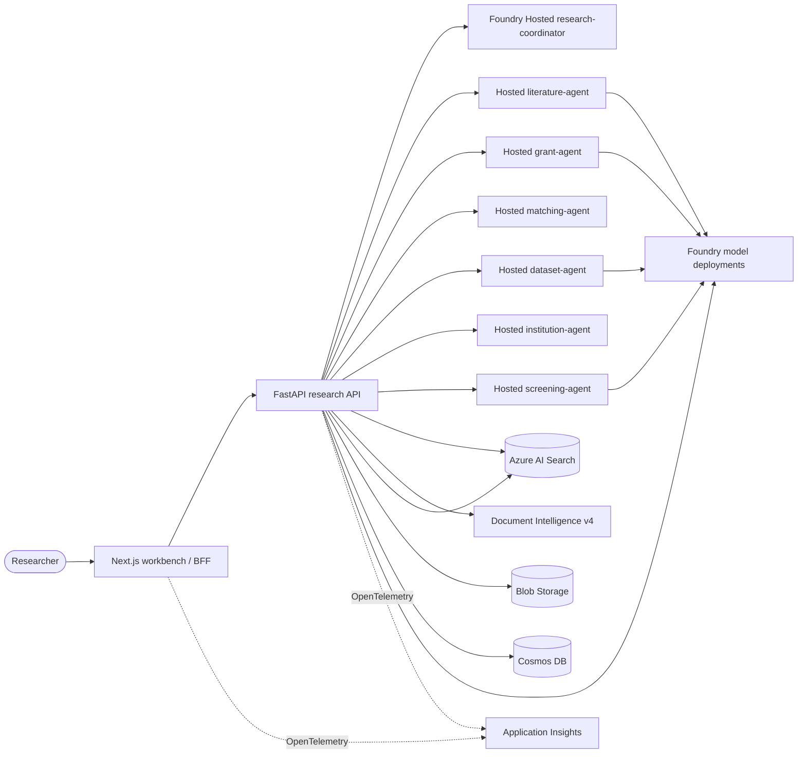

# Research Assistant Architecture

## Design principles

1. Evidence and provenance are typed data contracts, not prompt conventions.
2. Documents and tool output are untrusted data.
3. Agent reasoning is bounded by deterministic authorization, calculation,
   workflow, and approval code.
4. Each agent and workload receives the minimum Azure identity permissions.
5. Stable APIs are the base path; required Hosted Agent preview packages are
   isolated and exact-pinned.
6. Every vertical slice follows plan -> current research -> implement -> test.

## Runtime topology

## Hosted Agent contract

- `azure.yaml` contains one `azure.ai.project` service and seven
  `azure.ai.agent` services.
- Every agent uses `codeConfiguration` with Python 3.13 remote build.
- Every agent exposes Responses protocol `2.0.0`.
- The platform creates immutable versions, VM-isolated sessions, a dedicated
  endpoint, and a dedicated Entra identity.
- The coordinator calls specialists by agent name through
  `AIProjectClient.get_openai_client(agent_name=...)`; no `agent_reference`
  request body is used.
- Agent source lives under `agents/`; instruction and tool policy is selected
  by a profile-specific entry point.
- Each specialist declares a distinct workflow and output contract. The API
  owns typed artifacts; free-form Hosted Agent text is supplemental analysis.
- Checked-in agent manifests are unscoped templates and carry no tenant or
  project authority. Each Hosted Agent receives
  `RESEARCH_WORKSPACE_TENANT_ID` and `RESEARCH_WORKSPACE_PROJECT_ID` from the
  deployment environment. Startup binds those trusted values into a new frozen
  manifest, every capability binding, provider attestation, and the immutable
  release identity. Missing scope fails startup for capability-bearing agents;
  legacy `provider-discovery://` sentinels and cross-scope attestations or
  invocations are rejected.

### Release identity and lineage boundary

- `scripts/build_agent_source_tree.py` derives logical source identity from
  committed Git blobs at a named commit and `agents/` tree, using a versioned
  inclusion policy. It never hashes worktree, ZIP, or OCI bytes. The generated
  `agents/.release/source-tree.json` carries its own canonical digest, which
  runtime recomputes before accepting the identity. Because anyone can
  regenerate the manifest from its named Git objects, it is a correctness
  control rather than an unverified consistency snapshot.
- `HarnessSettings.source_tree_digest` is required. Making this field required
  is a deliberate exception to the harness's additive-only contract rule and
  marks an explicit release-lineage boundary. Missing manifests fail closed and
  name the producer; direct Python launches, offline harnesses, and deployment
  paths that bypass the producer receive no ambient filesystem fallback.
- A source-lineage change changes `release_id`. `ApprovalConsumptionRequest`
  includes `release_id` in its canonical digest, so an approval minted for a
  prior release is rejected with `approval_binding_mismatch` and must be issued
  again for the successor release. Idempotency lookup identity remains
  release-independent; release provenance is checked after record retrieval
  **on the `ACQUIRED` path only.** On `COMPLETED`, `capabilities.py:883-884`
  returns the stored result before `_consume_approval` at `:887`, and the
  provenance check at `:1080-1086` is `ACQUIRED`-gated — so a completed-replay
  returns without reaching it. **Latent, not live:** every shipped descriptor
  leaves `completed_replay` at its `DENY` default, so the path is unreachable in
  shipped configuration. One non-`DENY` descriptor makes it live.
- Predeploy validation rejects identity-eligible (`.py` + `requirements.txt`)
  tracked or untracked worktree
  drift so the direct-code remote-build upload cannot claim a committed source
  identity for different bytes. Checkout-only newline translation is allowed.
  **It does not cover the wider package-eligible set:** shipped non-Python files
  (`.agent_configs/baseline/metadata.yaml`, root `*.eval.yaml`,
  `datasets/**.jsonl`, `evaluators/**.{json,yaml}`) are outside the identity
  filter, so drifting one passes this check. Measured: 12 shipped-but-unhashed
  files. Closing that gap is tracked as F1.
  A future immutable deployed-artifact digest is separate evidence and must not
  be folded into release, approval, idempotency, or parent-lineage identity.

### Runtime governance boundary

- Production release promotion requires an application-owned durable release
  attestor to confirm the immutable release, schemas, source tree, model and
  provider pins, and every objective hard gate. Evaluator scores are advisory
  and never substitute for these gates. Foundry Hosted Agent startup uses the
  platform-managed identity, lifecycle, and Toolbox connections directly.
- Consequential capabilities claim durable idempotency first, atomically
  consume an exact-bound one-time `approval_decision_id`, persist the receipt,
  and only then resolve the runtime handler. Client booleans are never
  authorization.
- The API accepts a backend-owned `ApprovalContextResolverFactory` only through
  its application composition root. Lifespan binds the factory to the trusted
  workspace scope and accepts only a resolver declaring durable semantics.
  `RESEARCH_REQUIRE_APPROVAL_CONTEXT_RESOLVER=true` (and `prod`/`production`
  environments) fail startup when no provider is installed. Optional
  environments return 503 for approval-gated dataset compute rather than
  deriving authority from client input.
- Provider attachments require the exact
  `research-assistant.integration-provider.v6` wire contract and canonical
  OpenAPI SHA-256. The harness retains its runtime-neutral typed references,
  independently revalidates binding/resource/schema/policy/configuration pins,
  and resolves non-serialized handlers only after GA + ACTIVE attestation.
- Governance telemetry emits hashed tenant, actor, approval, and idempotency
  identifiers plus release/capability/outcome metadata. Payloads, queries,
  credentials, evidence content, and raw decision references are excluded.
- Hosted `ResponsesHostServer` entry points explicitly disable the beta
  hosting SDK's default observability initializer. Hosted exporters remain
  off until an application-owned configurator with deterministic lifecycle
  and managed-identity policy is injected.
- In-memory state, approval, idempotency, and attestation providers are local
  or test-only. Hosted conversation, user, project, or private-agent
  persistence stays disabled unless an application-owned durable provider is
  injected.
- `agent-framework-foundry-hosting==1.0.0b260721` remains an exact-pinned beta
  serving dependency. Agent Framework workflow orchestration is separately
  recorded as preview risk; neither is represented as GA.

## Online source layer

- The canonical literature, grant, and matching profiles receive shared
  Foundry Toolbox connector and Web Search tools only for an explicitly
  acknowledged public query; no separate online deployments exist.
- A server-side typed connector registry provides PubMed, Europe PMC, Crossref, OpenAlex,
  arXiv, ClinicalTrials.gov, Grants.gov, NIH RePORTER, DataCite, ORCID, ROR,
  and optional Semantic Scholar access.
- Each reviewed connector operation has a fixed source-specific adapter route.
  APIM exposes each connector as a separate MCP server and applies its
  managed-identity, Entra validation, content-validation, rate-limit, and
  diagnostics policy before the adapter reaches the public provider.
- A single APIM REST API (`research-connectors-v1`) holds every connector
  operation and its deterministic provider policy. Each connector MCP server
  exposes tools that reference those operations directly, which is the
  documented "expose a REST API as an MCP server" model. Tool ids are
  snake_case (`arxiv_search`); APIM rejects tool ids that collide with its own
  operation identifiers (`arxivSearch`) or the bare action names
  (`search`/`lookup`) with a persistent 502. Raw provider specifications
  are not included in the production Toolbox because the normalized connector
  catalog is the reviewed, bounded authority.
- Bicep owns the durable APIM service, identity, diagnostics, and narrowly
  scoped credential-writer role. Idempotent postprovision code owns connector
  APIs, policies, MCP surfaces, products, and missing secret slots. The
  Settings API alone sets or clears real connector keys, so repeat deployments
  cannot overwrite administrator-managed credentials.
- Literature, grant, and matching each consume a stable Foundry Toolbox
  consumer endpoint. Toolbox versions are immutable; provisioning creates a
  complete candidate version, validates its version-specific MCP `tools/list`
  inventory against the checked-in connector catalog, then promotes it as the
  default version. A connector Settings change never rebuilds a Toolbox.
- The Settings UI is the authoritative selector for a run. The API resolves
  enabled, ready, assigned connector IDs and sends them in a typed public
  hosted-agent envelope. Hosted middleware exposes only the matching
  `connector___operation` Toolbox tools for that request, rejects any
  off-list connector call, and requires returned source metadata to match the
  invoked connector before it becomes evidence.
- Each canonical profile has an explicit source allowlist. The institution
  agent has no tools and receives only server-authorized, version-resolved
  passages.
- Connectors cap queries/results, use official HTTPS endpoints, return metadata
  plus terms URLs, and do not bypass paywalls or bulk-download full text.
- The UI sends a separate public query and acknowledgement with every public
  workflow. The API rejects incomplete/ineligible requests, applies saved
  connector assignments, and invokes the canonical specialist deployment.
  Private runs expose no public tools, independent of request option support.
- Hosted Agents do not call multi-tenant Search. Tenant filtering, ACLs, source
  kinds, versions, and citations are resolved by the API before invocation.

## Evidence contract

Every Search document contains:

- immutable chunk and source IDs
- source kind and tenant ACLs
- title, section, page, version, and license
- text checksum
- searchable text and a `text-embedding-3-large` vector

Every user-facing citation resolves to this evidence and includes its retrieval
time. The API rejects section references to unknown citation IDs.

## Product and operational contracts

The six studios do not share one generic state machine:

| Studio | Deterministic contract | Human boundary |
|--------|------------------------|----------------|
| Literature | Protocol, screening decisions, extraction matrix, citation audit | Inclusion/exclusion review |
| Grant | Opportunity and requirement matrix, fact gaps, readiness | Package release/export |
| Matching | Hard filters and weighted score components | Availability/outreach |
| Dataset | Schema/quality profile, analysis steps, compute estimate | External compute |
| Institutional | Identity ACL, effective versions, conflicts, answer/abstain | Answer-gap escalation |
| Automation | Typed DAG, dependencies, retries, dry-run result | Activation/external steps |

Library items, run stages, connector assignments, settings, and approvals are
Cosmos-backed in Azure. Every new studio/ingestion run receives a stable run
identifier displayed in the UI. Approval records bind actor, timestamp,
rationale, exact action, destination, and idempotency key; decisions update the
associated run state directly.

Personal workspaces reuse the deployed serverless Cosmos account's existing
`research/projects` container, partitioned by tenant. Project catalog records
bind each active or archived project to one owner identity, and a separate
per-user preference record stores the active project ID. The API treats a
browser-supplied project header as a selection request only: it resolves the
record in the authenticated tenant partition and requires the matching owner
and active lifecycle before opening any workspace store. New projects copy
governance defaults but begin with no sources, runs, approvals, artifacts, or
connector credentials. No SQLite file, Azure SQL resource, Cosmos container,
or other Azure resource is introduced. The deployment's Foundry project is
still a trusted runtime scope, not a user-selectable workspace.

## Direct workflow execution

Hosted research and studio operations execute through the API request path.
Library ingestion is submitted to a FastAPI process-local background task after
the upload response is created. There is no durable queue, automatic retry,
pause/resume control, or restart recovery; an interrupted ingestion can remain
in `processing` until it is submitted again or repaired operationally.

External writes and large-scale compute remain blocked until an approval is
recorded. The `LargeScaleComputeAdapter` provides estimate, submit,
idempotency, and status contracts without pretending that a raw-data platform
is configured.

Runtime Library ingestion is:

`bounded upload -> private Blob -> Document Intelligence/layout -> structural
chunking -> Foundry embeddings -> Azure AI Search -> Cosmos ready state`

Microsoft's July 2026 guidance recommends Content Understanding for new managed
Search skillsets. This accelerator retains direct Document Intelligence in its
deterministic API ingestion path because Search is intentionally in a different
region, the existing resource is already deployed, and the application must preserve
checksum/ACL/version lineage. Content Understanding remains a gated upgrade,
not an implicit behavior change.

## Azure resource map

- Microsoft Foundry account/project and three model deployments
- seven Foundry Hosted Agents: coordinator and six specialists; literature,
  grant, and matching can consume governed public tools per request
- API Management Standard v2 with one MCP server per reviewed public
  connector, plus a temporary shared fallback MCP server during the staged
  migration
- Azure AI Search Basic, hybrid/vector/semantic index
- Document Intelligence S0, `prebuilt-layout` v4 GA
- Blob Storage
- Cosmos DB serverless
- Container Registry Basic
- Container Apps environment with web/API
- Log Analytics and workspace-based Application Insights
- API user-assigned managed identity
- VNet-integrated Container Apps environment
- Blob and Cosmos private endpoints and private DNS zone links

The web and API remain warm for the demo profile.

## Deployment sequencing

1. `preprovision` validates every required service/SKU and exact model in the
  selected region.
2. Bicep provisions resources and data-plane roles.
3. `postprovision` creates the Search index, uploads synthetic evidence,
   creates connector-specific Foundry project connections, and reconciles and
   validates Toolbox versions before promoting them.
4. `azd deploy` creates Hosted Agent versions and deploys Container Apps.
5. `postdeploy` grants the coordinator only the Foundry delegation role.
6. Smoke and evaluation suites verify the deployed endpoints.
