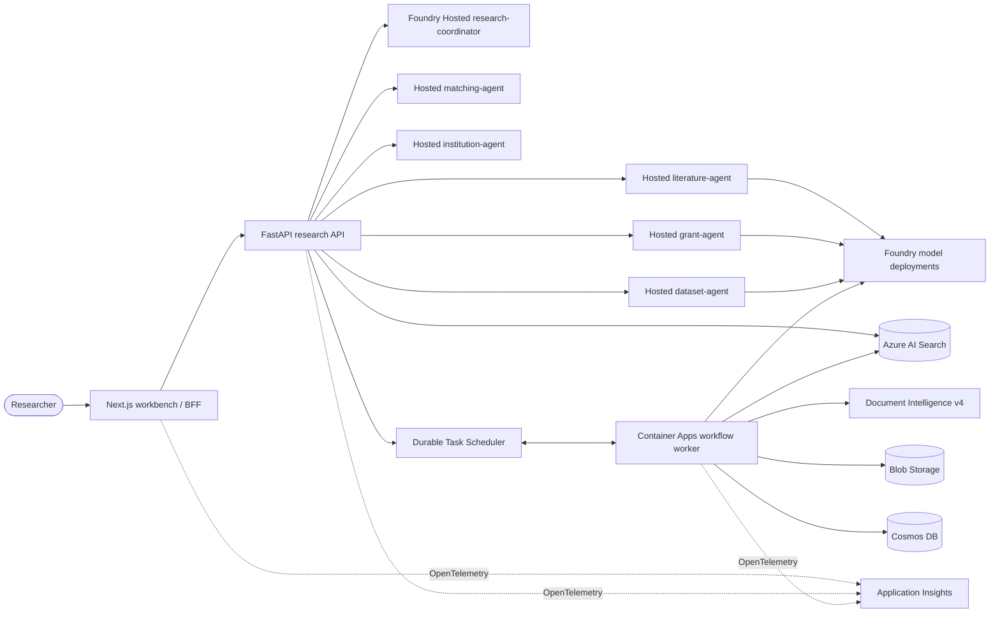

# Research Assistant Architecture

## Design principles

1. Evidence and provenance are typed data contracts, not prompt conventions.
2. Documents and tool output are untrusted data.
3. Agent reasoning is bounded by deterministic authorization, calculation,
   workflow, and approval code.
4. Each agent and workload receives the minimum Azure identity permissions.
5. Stable APIs are the base path; required Hosted Agent preview packages are
   isolated and exact-pinned.
6. Every vertical slice follows plan -> current research -> implement -> test.

## Runtime topology

## Hosted Agent contract

- `azure.yaml` contains one `azure.ai.project` service and nine
  `azure.ai.agent` services.
- Every agent uses `codeConfiguration` with Python 3.13 remote build.
- Every agent exposes Responses protocol `2.0.0`.
- The platform creates immutable versions, VM-isolated sessions, a dedicated
  endpoint, and a dedicated Entra identity.
- The coordinator calls specialists by agent name through
  `AIProjectClient.get_openai_client(agent_name=...)`; no `agent_reference`
  request body is used.
- Agent source lives under `agents/`; instruction and tool policy is selected
  by a profile-specific entry point.
- Each specialist declares a distinct workflow and output contract. The API
  owns typed artifacts; free-form Hosted Agent text is supplemental analysis.

## Online source layer

- Three dedicated public-online profiles receive Foundry Web Search only for
  an explicitly acknowledged public query.
- A server-side typed connector registry provides PubMed, Europe PMC, Crossref, OpenAlex,
  arXiv, ClinicalTrials.gov, Grants.gov, NIH RePORTER, DataCite, ORCID, ROR,
  and optional Semantic Scholar access.
- Each profile has an explicit source allowlist. The institution agent has no
  tools and receives only server-authorized, version-resolved passages.
- Connectors cap queries/results, use official HTTPS endpoints, return metadata
  plus terms URLs, and do not bypass paywalls or bulk-download full text.
- The UI sends a separate public query and acknowledgement with every online
  workflow. The API rejects incomplete/ineligible requests, applies saved
  connector assignments, and invokes a separate online deployment. Offline
  specialists contain no tools, independent of request option support.
- Hosted Agents do not call multi-tenant Search. Tenant filtering, ACLs, source
  kinds, versions, and citations are resolved by the API before invocation.

## Evidence contract

Every Search document contains:

- immutable chunk and source IDs
- source kind and tenant ACLs
- title, section, page, version, and license
- text checksum
- searchable text and a `text-embedding-3-large` vector

Every user-facing citation resolves to this evidence and includes its retrieval
time. The API rejects section references to unknown citation IDs.

## Product and operational contracts

The six studios do not share one generic state machine:

| Studio | Deterministic contract | Human boundary |
|--------|------------------------|----------------|
| Literature | Protocol, screening decisions, extraction matrix, citation audit | Inclusion/exclusion review |
| Grant | Opportunity and requirement matrix, fact gaps, readiness | Package release/export |
| Matching | Hard filters and weighted score components | Availability/outreach |
| Dataset | Schema/quality profile, analysis steps, compute estimate | External compute |
| Institutional | Identity ACL, effective versions, conflicts, answer/abstain | Answer-gap escalation |
| Automation | Typed DAG, dependencies, retries, dry-run result | Activation/external steps |

Library items, run stages, connector assignments, settings, and approvals are
Cosmos-backed in Azure. Every new studio/ingestion run is scheduled under the
same `durable_instance_id` displayed in the UI. Approval records bind actor,
timestamp, rationale, exact action, destination, and idempotency key; approval
events resume that same orchestration instance.

## Durable workflow

The worker uses the managed Durable Task Scheduler, not the legacy Durable
Functions Storage backend. Activities exchange Blob/manifest references rather
than payloads above the scheduler's 1 MB limit.

The baseline research pipeline is:

`ingest -> retrieve -> synthesize -> verify -> approval -> complete`

Retries are bounded. External writes and large-scale compute remain blocked
until an approval event is recorded. The `LargeScaleComputeAdapter` provides
estimate, submit, idempotency, and status contracts without pretending that a
raw-data platform is configured.

Runtime Library ingestion is:

`bounded upload -> private Blob -> Document Intelligence/layout -> structural
chunking -> Foundry embeddings -> Azure AI Search -> Cosmos ready state`

Microsoft's July 2026 guidance recommends Content Understanding for new managed
Search skillsets. This accelerator retains direct Document Intelligence in its
deterministic worker because Search is intentionally in a different region,
the existing resource is already deployed, and the worker must preserve
checksum/ACL/version lineage. Content Understanding remains a gated upgrade,
not an implicit behavior change.

## Azure resource map

- Microsoft Foundry account/project and three model deployments
- nine Foundry Hosted Agents: coordinator, five tool-free specialists, and
  three public-online researchers
- Azure AI Search Basic, hybrid/vector/semantic index
- Document Intelligence S0, `prebuilt-layout` v4 GA
- Blob Storage
- Cosmos DB serverless
- Durable Task Scheduler Consumption
- Container Registry Basic
- Container Apps environment with web/API/worker
- Log Analytics and workspace-based Application Insights
- separate API and worker user-assigned managed identities
- VNet-integrated Container Apps environment
- Blob and Cosmos private endpoints and private DNS zone links

The web and API remain warm for the demo profile; the worker keeps one small
replica for the scheduler's push connection.

## Deployment sequencing

1. `preprovision` validates every required service/SKU and exact model in the
   selected region, then registers Durable Task when needed.
2. Bicep provisions resources and data-plane roles.
3. `postprovision` creates the Search index and uploads synthetic evidence.
4. `azd deploy` creates Hosted Agent versions and deploys Container Apps.
5. `postdeploy` grants the coordinator only the Foundry delegation role.
6. Smoke and evaluation suites verify the deployed endpoints.
